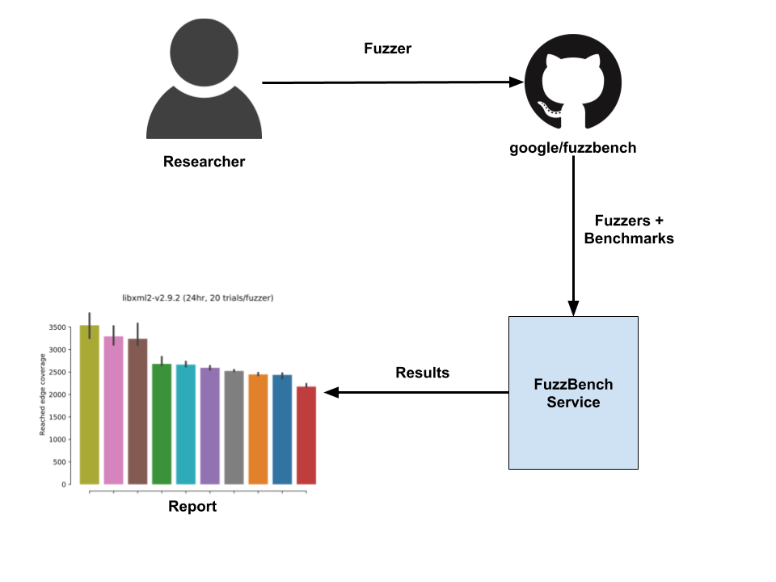

# FuzzBench: Fuzzer Benchmarking As a Service

FuzzBench is a free service that evaluates fuzzers on a wide variety of
real-world benchmarks, at Google scale. The goal of FuzzBench is to make it
painless to rigorously evaluate fuzzing research and make fuzzing research
easier for the community to adopt. We invite members of the research community
to contribute their fuzzers and give us feedback on improving our evaluation
techniques.

FuzzBench provides:

* An easy API for integrating fuzzers.
* Benchmarks from real-world projects. FuzzBench can use any
  [OSS-Fuzz](https://github.com/google/oss-fuzz) project as a benchmark.
* A reporting library that produces reports with graphs and statistical tests
  to help you understand the significance of results.

To participate, submit your fuzzer to run on the FuzzBench platform by following
[our simple guide](
https://google.github.io/fuzzbench/getting-started/).
After your integration is accepted, we will run a large-scale experiment using
your fuzzer and generate a report comparing your fuzzer to others.
See [a sample report](https://www.fuzzbench.com/reports/sample/index.html).

## Overview

## Sample Report

You can view our sample report
[here](https://www.fuzzbench.com/reports/sample/index.html) and
our periodically generated reports
[here](https://www.fuzzbench.com/reports/index.html).
The sample report is generated using 10 fuzzers against 24 real-world
benchmarks, with 20 trials each and over a duration of 24 hours.
The raw data in compressed CSV format can be found at the end of the report.

When analyzing reports, we recommend:
* Checking the strengths and weaknesses of a fuzzer against various benchmarks.
* Looking at aggregate results to understand the overall significance of the
  result.

Please provide feedback on any inaccuracies and potential improvements (such as
integration changes, new benchmarks, etc.) by opening a GitHub issue
[here](https://github.com/google/fuzzbench/issues/new).

## Documentation

Read our [detailed documentation](https://google.github.io/fuzzbench/) to learn
how to use FuzzBench.

## Contacts

Join our [mailing list](https://groups.google.com/forum/#!forum/fuzzbench-users)
for discussions and announcements, or send us a private email at
[fuzzbench@google.com](mailto:fuzzbench@google.com).
